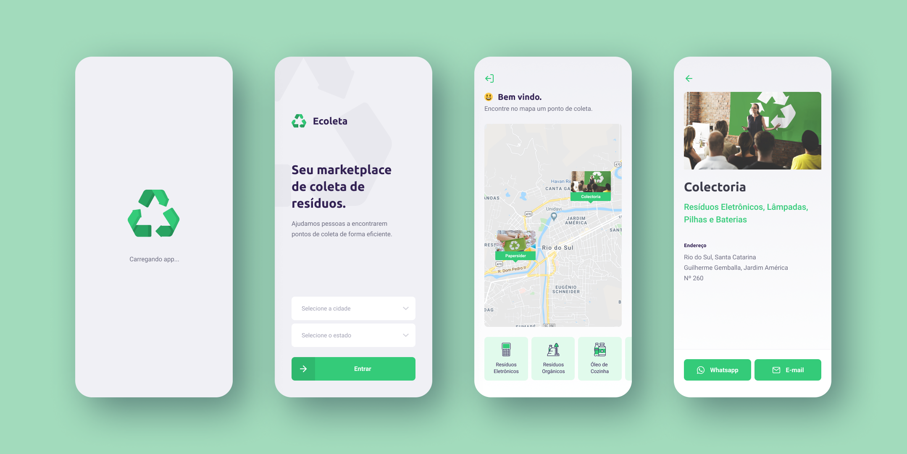

<!-- Logo -->

  

<!-- Badges -->

  
  
  
  
  

<!-- Indice-->

 <a href="#memo-sobre">Sobre</a> •
 <a href="#gear-funcionalidades">Funcionalidades</a> •
 <a href="#wrench-tecnologias">Tecnologias</a> •
 <a href="#-layout">Layout</a> •  
 <a href="#-preview">Preview</a> •
 <a href="#-como-executar-o-projeto">Executando</a> •
 <a href="#-licença">Licença</a>

## :memo: Sobre

O **Ecoleta** foi criado com o intuito de ser um marketplace que ajuda pessoas a encontrarem pontos de coleta de resíduos de forma eficiente. Ele foi um projeto desenvolvido durante a **Next Level Week 1**, um evento organizado pela Rocketseat que busca no período de uma semana a criação de uma aplicação completa, englobando as partes web, mobile e server.

## :gear: Funcionalidades

### Web

- [x] Cadastro do ponto de coleta
  - [x] Imagens do estabelecimento
  - [x] Dados da entidade - Nome, E-mail e Whatsapp
  - [x] Endereço - Coordenadas, Número, Cidade, Estado
  - [x] Itens de coleta - Lâmpadas, Pilhas e Baterias, Papéis e Papelão, Resíduos Eletrônicos, Resíduos Orgânicos, Óleo de Cozinha

### Mobile

- [x] Acessar pontos de coletas cadastrados - **Mobile**

- [x] Entrar em contato com a entidade através do E-mail ou WhatsApp - **Mobile**

## :wrench: Tecnologias Utilizadas

<table>
  <tbody>
    <tr>
      <td align="center">
        
        
HTML

      </td>
      <td align="center">
        
        
CSS

      </td>
      <td align="center">
        
        
React

      </td>
      <td align="center">
        
        
React Native

      </td>
      <td align="center">
        
        
Typescript

      </td>
      <td align="center">
        
        
Node.js

      </td>
      <td align="center">
        
        
SQLite

      </td>
      <td align="center">
        
        
knex

      </td>
    </tr>
  </tbody>
</table>

## :art: Layout

### Web - [Figma](https://www.figma.com/file/sE1kNJ5J9GkJUk6LpEFHjO/Ecoleta)

### Mobile - [Figma](https://www.figma.com/file/sE1kNJ5J9GkJUk6LpEFHjO/Ecoleta)

## Preview

  Gif Web - Link da Aplicação
  Gif Mobile - Link da Aplicação

## Executando

  Servidor
  Web
  Mobile

## Licença
